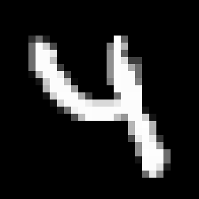
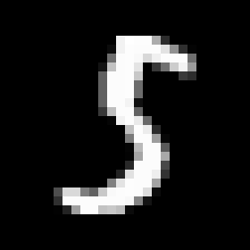
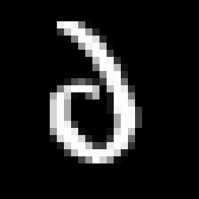
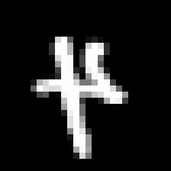
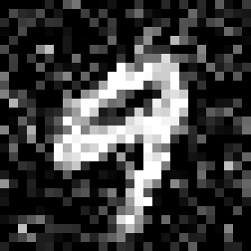
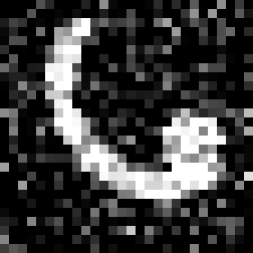
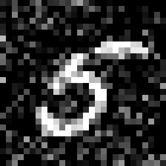

# Model-centric data manifold: the data through the eyes of the model

This repository contains the code used to perform the experiments of the paper 
"Model-centric data manifold: the data through the eyes of the model".

## Getting started

The repository contains:
- a `checkpoint` directory containing a checkpoint of a small CNN partially trained
on MNIST;
- the package `model_manifold` that includes functions to move along a leaf
of the foliation as well as to move across different leaves;
- many scripts needed to perform every single experiment on MNIST reported in the paper.

### Prerequisites

In order to run the code you need to have Python 3.6 or above installed.
We have performed our experiments with Python 3.8.5.

Remember to install all requirements with
```
python3 -m pip install -r requirements.txt
```

## Partial training on MNIST

To reproduce our partial training on MNIST, run
```
python3 mnist_training.py
```

The command above trains the small CNN defined in `mnist_networks.py` for a single epoch
to prevent convergence and at the end of every epoch it saves a checkpoint in the
`checkpoint` directory.

Many configuration parameters can be modified using the script CLI.
To inspect those parameters it is sufficient to display the help page with  
```
python3 mnist_training.py --help
```

## Visualizing paths on the foliation

The experiments reported in the paper can be reproduced executing the scripts
`mnist_kernel.py`, `mnist_data_leaf.py`, `mnist_noise_leaf.py`.

All those scripts take a model checkpoint as input and they compute
paths in the data domain according to the foliation induced by the model.

The scripts have two effects:
- they export a `.gif animation of the evolution in the `outputs` directory;`
- they display an image reporting intermediate steps of the evolution.

The scripts have these optional parameters:
- `--start`: the index in the MNIST test set of the source image;
- `--end`: the index in the MNIST test set of the destination image (if needed);
- `--seed`: random seed to control the sampling of source and destination image;
- `--output-dir`: output directory of the .gif.

If `--start` (or `--end`) is not specified it is chosen at random.

### Moving across leaves in the foliation

To move across leaves in the foliation, the data should evolve along
directions in the kernel of the local data matrix.
In this experiment, we take a valid image in MNIST test set and a random
direction and we let the image evolve along the projection of such direction
on the kernel of the data matrix.

You can reproduce the experiment running
```
python3 mnist_kernel.py checkpoint/small_cnn_01.pt 
```

Here we report some outputs of the script.





### Moving along the data leaf

To move along the data leaf leaves, the data should evolve along
directions orthogonal to the kernel of the local data matrix.
In this experiment, we take two valid images in MNIST test set and 
we let the source image evolve to reach the destination image.

You can reproduce the experiment running
```
python3 mnist_data_leaf.py checkpoint/small_cnn_01.pt 
```

Here we report some outputs of the script.





Adding the boolean flag `--flip`, it is possible to verify that also
flipped digits (images that sometimes resemble latin letters)
belong to the data leaf, since it is possible to join them with a valid digit.

In this case the command becomes 
```
python3 mnist_data_leaf.py checkpoint/small_cnn_01.pt --flip
```

Here we report some outputs of this command.





### Moving across leaves in the foliation then along a noisy leaf

We combine the two experiments above to verify that movements
along a leaf preserve the noise in the image.

You can reproduce the experiment running
```
python3 mnist_noise_leaf.py checkpoint/small_cnn_01.pt 
```

Here we report some outputs of the script.





